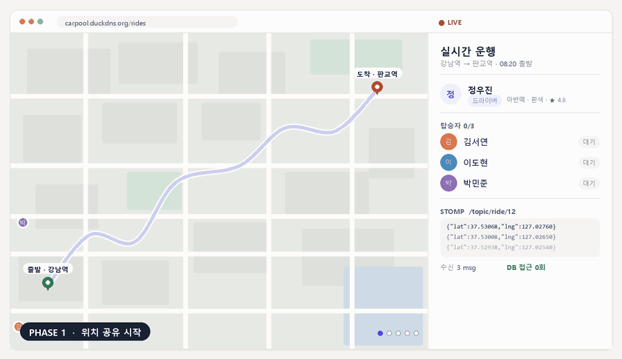
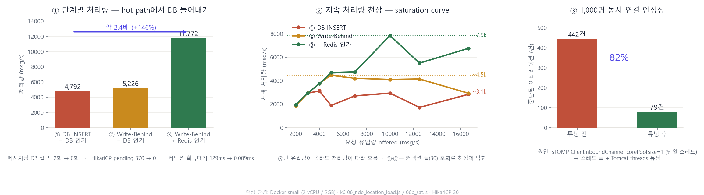
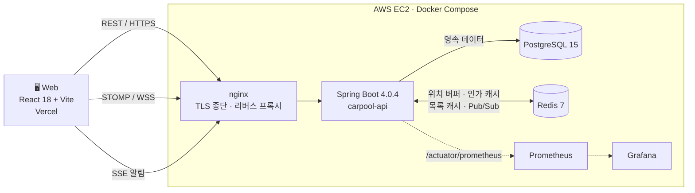
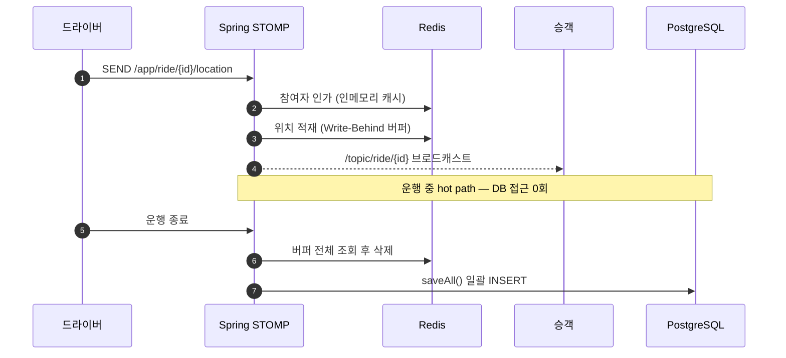
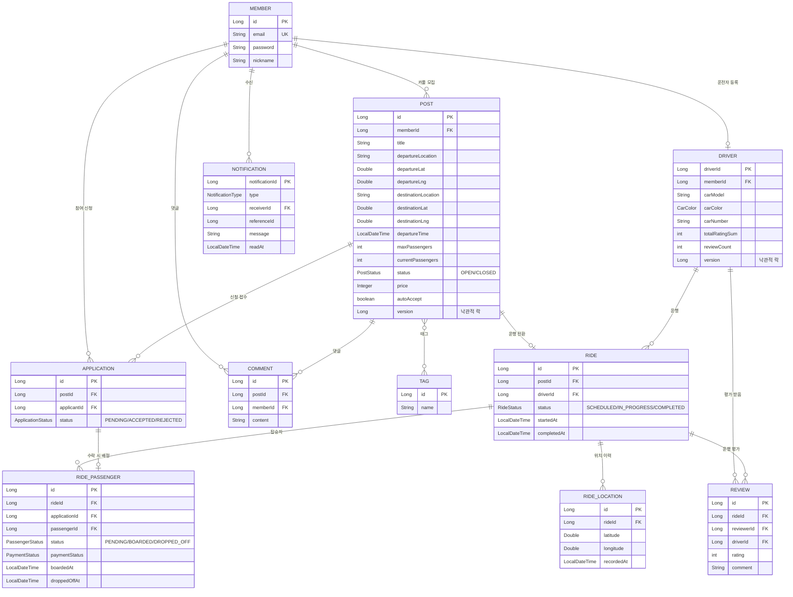
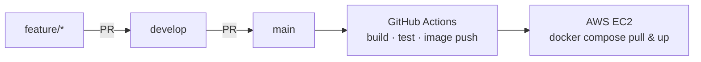

<div align="center">

# 🚗 같이타 (Carpool)

**목적지가 같은 사람을 연결하고, 운행 중 위치를 실시간으로 공유하는 카풀 매칭 서비스**

[](https://github.com/techeer-2026-teamC/carpool/actions/workflows/gradle.yml)


<br>



<sub>드라이버·승객 위치가 STOMP로 흐르는 동안, 서버는 **DB를 한 번도 들르지 않습니다.**</sub>

<br>

[백엔드 (현재 저장소)](https://github.com/techeer-2026-teamC/carpool) · [프론트엔드](https://github.com/techeer-2026-teamC/carpool-front) · [기술 블로그](#-기술적-도전)

</div>

---

## 📖 목차

- [무엇을 만들었나](#-무엇을-만들었나)
- [기술적 도전](#-기술적-도전) — **이 프로젝트의 핵심**
- [아키텍처](#-아키텍처)
- [ERD](#-erd)
- [주요 기능](#-주요-기능)
- [기술 스택](#-기술-스택)
- [빠른 시작](#-빠른-시작)
- [API 개요](#-api-개요)
- [테스트 & 부하 테스트](#-테스트--부하-테스트)
- [배포](#-배포)
- [협업 규칙](#-협업-규칙)
- [팀](#-팀)

---

## 🎯 무엇을 만들었나

같은 시간, 같은 방향으로 가는 사람들을 묶어주는 카풀 서비스입니다. 게시글로 카풀을 모집하고, 신청·수락을 거쳐 운행이 시작되면 **드라이버와 승객의 위치가 지도 위에서 실시간으로 흐릅니다.**

이 주제를 고른 이유는 명확합니다. 토이 프로젝트에서 대규모 트래픽을 만나기는 어렵지만, **이 서비스는 구조 자체가 두 종류의 어려운 문제를 강제로 데려옵니다.**

| 서비스 구조 | 따라오는 기술 문제 |
|---|---|
| 위치를 초 단위로 계속 쏜다 | **고빈도 쓰기** — 사용자가 적어도 메시지는 폭증한다 |
| 남은 한 자리에 여러 명이 동시에 신청한다 | **동시성** — Lost Update로 정원이 깨진다 |
| 목록을 끊임없이 조회한다 | **read-heavy 조회 성능** — 데이터가 쌓일수록 느려진다 |

그래서 기능을 붙이는 데서 멈추지 않고, **셋 다 부하 테스트로 병목을 규명하고 수치로 검증**했습니다. 아래가 그 기록입니다.

---

## 🔥 기술적 도전

### ① 실시간 위치 — 메시지마다 DB를 들르던 구조를 들어내기

> 📈 **처리량 약 2.4배 (4,792 → 11,772 msg/s) · 메시지당 DB 접근 2회 → 0회 · 1,000명 동시 연결 중단 −82%**



<details open>
<summary><b>과정 펼쳐 보기</b></summary>

<br>

**문제.** 위치 메시지 한 건마다 DB를 두 번 들렀습니다. ① 이 사용자가 이 운행에 참여 중인지 인가 조회, ② 위치 `INSERT`. 40초 운행 한 번에 약 **186,000행**이 쌓였고, HikariCP는 pending 370건 / 커넥션 획득 대기 129ms로 포화됐습니다.

**1차 가설과 실패.** "커넥션 풀을 키우면 되지 않을까?" — 풀을 30 → 200으로 늘렸더니 오히려 **−11%(역 U자)**. 풀을 키우면 DB 쪽 컨텍스트 스위칭과 락 경합이 늘어, 대기 장소만 바뀌고 천장은 그대로였습니다. **병목은 풀 크기가 아니라 "hot path가 매 메시지 DB 커넥션을 잡는다는 사실 그 자체"** 였습니다.

**해결 — hot path에서 DB를 통째로 들어내기.**

| 단계 | 방법 | 처리량 |
|---|---|---|
| ① | DB INSERT + DB 인가 (기준선) | 4,792 msg/s |
| ② | **Write-Behind** — 위치를 Redis 버퍼에 쌓고 운행 종료 시 `saveAll()` 일괄 INSERT | 5,226 msg/s |
| ③ | **+ Redis 인가 캐시** — 참여자 검증도 인메모리로 | **11,772 msg/s** |

지속 처리량 천장(saturation curve)으로 보면 차이가 더 분명합니다 — **① ~3.1k · ② ~4.5k · ③ ~7.9k.** 풀 튜닝으로 도달 가능한 최선(pool=10, 2,526)과 비교해도 **3.1배**입니다. 풀은 DB 천장 *아래에서* 줄 서는 위치만 바꾸고, Redis는 **천장 자체를 올립니다.**

**별개의 병목 — 연결 단계.** 처리량과 무관하게 SCALE=1000에서 WS 연결 p95가 10초까지 치솟고 442건이 중단됐습니다. 원인은 Spring STOMP `ClientInboundChannel`의 **기본 `corePoolSize = 1`** — 1,000개의 CONNECT 프레임을 한 스레드가 직렬 처리하고 있었습니다. inbound 채널 스레드 풀과 Tomcat `threads.max`를 함께 열어 **중단 442 → 79건(−82%)**.

**후속 검증.** 그럼 풀 200은 적정한가? 1~200으로 스윕했더니 처리량은 전 구간 ~4k로 평탄하고 CPU는 ~210%(2코어)로 포화 — **천장이 스레드가 아니라 CPU로 옮겨간 것**을 확인했습니다. Brian Goetz 공식 `N = N_cpu × U × (1 + W/C)` ≈ 18과 교차검증해 적정값 **~32**를 도출했습니다.

**한계.** 위치가 Redis에만 있는 구간이 생겨 **Redis 장애 시 해당 운행의 위치 이력이 유실되는 SPOF**가 생겼습니다. 실시간 브로드캐스트는 계속되지만 이력은 복구되지 않습니다. 성능과 맞바꾼 비용으로 인지하고 있습니다.

📝 **전문:** [실시간 위치 공유, 매 메시지마다 DB를 들르던 구조를 들어내기까지](docs/blog/websocket-location-redis.md)

</details>

<br>

### ② 조회 — 인덱스로 15배, 캐시로 25배

> 📈 **목록 조회 p95 4.72s → 303ms (인덱스) · 100만 건에서 2,009ms → 81ms (캐시)**

<details>
<summary><b>과정 펼쳐 보기</b></summary>

<br>

**인덱스.** `LIMIT 20`인데도 게시글 10만 건에서 목록 조회 p95가 **4.72초**였습니다. `WHERE status = 'OPEN' AND departure_time > now()`를 풀스캔한 뒤 정렬하고 있었기 때문입니다. `(status, departure_time)` 복합 인덱스로 **303ms(약 15배)**.


**흥미로운 연쇄 효과.** 느린 `list_posts`가 HikariCP 커넥션 30개를 독식하던 구조라, 인덱스로 이게 풀리자 **전혀 무관한 API들까지 함께 회복**됐습니다 (tags 1.15s → 9ms, location_poll 1.15s → 4ms). 커넥션 풀은 공유 자원이라 느린 쿼리 하나가 전체 API를 마비시킬 수 있다는 걸 실측으로 확인했습니다.

**캐시.** 인덱스는 "첫 20건"을 빠르게 찾아주지만, 페이지네이션의 `COUNT(*)`는 **매칭 집합 전체에 비례**합니다. 데이터를 1만 → 10만 → 100만 건으로 늘리자 캐시 미스 한 건이 **2,009ms**까지 치솟았습니다.

| 데이터 양 | 캐시 MISS (DB 경로) | 캐시 HIT p95 | HIT 처리량 |
|---|---|---|---|
| 1만 건 | 42 ms | 99.96 ms | 1,015 rps |
| 10만 건 | 46 ms | 82.51 ms | 2,204 rps |
| 100만 건 | **2,009 ms** | **80.94 ms** | 2,125 rps |


`upcoming-posts`(오늘~+48h 출발 글)를 Redis에 TTL 5분으로 캐시하자, 데이터가 100만 건이 되어도 응답이 **~80ms로 평평**합니다.

**5분 stale이 왜 괜찮은가.** 카풀은 택시 콜이 아닙니다. 사람들은 보통 **내일 아침 카풀을 어제 저녁에 미리 올립니다.** 글 작성과 출발 사이에 몇 시간~하루의 여유가 있어 분 단위 stale이 무해하고, 작성·수정·삭제·마감 시에는 `@CacheEvict(allEntries=true)`로 즉시 무효화합니다.

> 💡 같은 서비스 안에서도 답이 다릅니다. **실시간 위치**는 초 단위 신선도가 필요해 캐시 대신 Write-Behind를, **게시글 목록**은 분 단위 stale이 허용돼 5분 TTL을 썼습니다.

📝 **전문:** [조회는 빠르게, 동시성은 안전하게 — 인덱스 · 캐시 · 낙관적 락](docs/blog/caching-lock-index.md)

</details>

<br>

### ③ 동시성 — 정원 3명에 1,000명이 동시에 신청해도 정확히 3명

> 📈 **동시 신청 1,000명 → 성공 정확히 3건 · 재시도 정책 스윕으로 성공률 9.4% → 93.1%**

<details>
<summary><b>과정 펼쳐 보기</b></summary>

<br>

**문제 — Lost Update.** 남은 좌석 1개에 A·B·C가 동시에 신청하면, 셋 다 "잔여 1석"을 읽고 셋 다 성공해 **정원을 초과해 태우게** 됩니다.

**선택 — 비관적 락이 아니라 낙관적 락.** 실제 충돌은 "막판 한 자리" 같은 드문 순간에만 몰립니다. 평상시 비용 0, 충돌할 때만 비용을 치르는 `@Version` 기반 낙관적 락을 택했습니다.

**재시도가 진짜 핵심.** 낙관적 락은 충돌 시 예외를 던지므로 재시도 정책이 성패를 가릅니다. 한 row에 50 VU가 30초간 동시 쓰기를 날려 정책을 바꿔가며 실측했습니다.

| 정책 | 성공률 | 요청당 재시도 | 대기 median |
|---|---|---|---|
| 재시도 없음 | 9.4% | 0.00 | 81 ms |
| 즉시 재시도 (0ms) | 39.3% | **3.02** | 102 ms |
| 고정 (50ms) | 85.0% | 0.88 | 34 ms |
| 지수 (50ms×1.5) | 91.8% | 0.49 | 35 ms |
| **지수 + 지터** ✅ | **93.1%** | **0.40** | 35 ms |


- **백오프 없는 즉시 재시도가 최악** — 성공률 39%인데 요청당 3회 busy-loop로 CPU를 잡아먹어 median까지 가장 느립니다. 재시도에 백오프가 없으면 불에 기름입니다.
- **지터가 성공률 최고 + 재시도 최소.** 대신 꼬리 지연(p95/max)은 가장 깁니다 — 전체 경합을 줄이는 대가로 불운한 소수의 꼬리를 양보하는 트레이드오프이고, 우리는 이쪽을 택했습니다.

**결과 (k6 `04_race_condition.js`, `maxPassengers=3`)**

| 동시 신청자 | 성공(201) | 거절(409) |
|---|---|---|
| 10 | 3 | 7 |
| 100 | 3 | 97 |
| **1,000** | **3** | 997 |

정원은 **타이밍(운)이 아니라 락으로 보장**됩니다. 충돌 급증은 Grafana `carpool_optimistic_lock_conflicts_total`로 관찰됩니다.

📝 **전문:** [좌석 1개에 3명이 동시에 신청하면? — 낙관적 락으로 푼 이야기](docs/blog/seat-concurrency-optimistic-lock.md)

</details>

---

## 🏗 아키텍처



### 실시간 위치가 흐르는 길

hot path에서 DB가 빠져 있다는 점이 핵심입니다.



---

## 🗄 ERD



> 도메인 간 결합을 낮추기 위해 연관은 대부분 **ID 참조**로 두고, `RIDE ─ RIDE_PASSENGER`처럼 생명주기를 공유하는 곳만 JPA 연관관계를 씁니다.

---

## ✨ 주요 기능

| 도메인 | 기능 |
|---|---|
| 🔐 **인증** | JWT 로그인 / 회원가입, Refresh Token Rotation (HttpOnly 쿠키), 로그아웃 블랙리스트 |
| 👤 **회원 · 드라이버** | 프로필 관리, 차량 등록(모델·색상·번호), 평점 집계 |
| 📝 **게시글** | 카풀 모집 CRUD, 태그 필터, 날짜/위치 검색, 자동 마감 스케줄러, 목록 캐시 |
| 💬 **댓글** | 게시글 문의·조율 |
| 🙋 **신청** | 신청 / 수락 / 거절, **낙관적 락으로 좌석 초과·중복 방지**, 자동 수락 옵션 |
| 🚘 **운행** | 운행 시작·종료, 탑승·하차 확인, **WebSocket 실시간 위치 공유** |
| ⭐ **리뷰** | 운행 완료 후 드라이버 평가 · 평점 반영 |
| 🔔 **알림** | Redis Pub/Sub → SSE 실시간 푸시 |

---

## 🛠 기술 스택

| 분류 | 기술 |
|------|------|
| **Language** | Java 17 |
| **Framework** | Spring Boot 4.0.4 · Spring Security 7 · Spring Data JPA |
| **Database** | PostgreSQL 15 (운영) · H2 (테스트) |
| **Cache / PubSub** | Redis 7 (위치 Write-Behind 버퍼 · 인가 캐시 · 목록 캐시 · 알림 Pub/Sub) |
| **Realtime** | WebSocket (STOMP) · SSE |
| **Auth** | JWT (JJWT 0.12.6) · BCrypt · Google OAuth2 |
| **API Docs** | SpringDoc (Swagger UI) |
| **Infra** | Docker Compose · nginx · AWS EC2 · GitHub Actions |
| **Monitoring** | Prometheus · Grafana (JVM · 비즈니스 · k6 대시보드) |
| **Load Test** | k6 |

---

## 🚀 빠른 시작

### 1. 환경 변수

```bash
cp .env.sample .env
```

```env
JWT_SECRET=local-dev-secret-key-please-change-in-production
DOCKER_USERNAME=local
# 소셜 로그인 사용 시 (팀 단톡방 자격증명 참고)
GOOGLE_CLIENT_ID=your_google_client_id_here
GOOGLE_CLIENT_SECRET=your_google_client_secret_here
```

### 2. 실행

```bash
docker compose up -d                            # DB · Redis · 앱
docker compose --profile monitoring up -d       # + Prometheus · Grafana
```

| 서비스 | 주소 |
|--------|------|
| 🌐 API | http://localhost:8080 |
| 📚 Swagger | http://localhost:8080/swagger-ui.html |
| 📊 Grafana | http://localhost:3000 (admin / admin) |
| 📈 Prometheus | http://localhost:9090 |

> **로컬 프로파일**에서는 테스트 계정이 자동 생성됩니다.
> 드라이버 `test@carpool.com` / `password1234` · 승객 `admin@carpool.com` / `admin1234!`

<details>
<summary><b>📂 프로젝트 구조</b></summary>

```
carpool/
├── backend/                          # Spring Boot 애플리케이션
│   └── src/main/java/com/techeer/carpool/
│       ├── domain/                   # 도메인별 패키지 (controller · dto · entity · repository · service)
│       │   ├── auth/                 #   인증 (JWT, 로그인, 토큰 재발급)
│       │   ├── member/               #   회원
│       │   ├── driver/               #   드라이버 · 차량
│       │   ├── post/                 #   게시글 · 태그
│       │   ├── comment/              #   댓글
│       │   ├── application/          #   카풀 신청 (낙관적 락)
│       │   ├── ride/                 #   운행 · 실시간 위치 (Write-Behind)
│       │   ├── review/               #   리뷰 · 평점
│       │   └── notification/         #   알림 (Redis Pub/Sub + SSE)
│       └── global/                   # config · jwt · exception · metrics · common
├── k6/                               # 부하 테스트
│   ├── scenarios/                    #   01~09 시나리오
│   └── utils/                        #   auth · data · checks 헬퍼
├── grafana/provisioning/             # Grafana 대시보드 · 데이터소스
├── deploy/                           # EC2 셋업 스크립트 · 배포 런북
├── nginx/                            # 리버스 프록시 · TLS 설정
├── docs/                             # 기술 블로그 · README 에셋
├── docker-compose.yml                # 로컬
├── docker-compose.prod.yml           # 운영 (EC2)
└── prometheus.yml
```

</details>

---

## 🔌 API 개요

| 도메인 | 대표 엔드포인트 |
|--------|----------------|
| **Auth** | `POST /api/v1/auth/signup` · `login` · `refresh` · `logout` |
| **Member** | `GET /api/v1/members/me` · 프로필 수정 · 탈퇴 |
| **Driver** | `POST /api/v1/drivers` · `GET /drivers/me` · 차량 색상 목록 |
| **Post** | `GET·POST /api/v1/posts` · 단건 조회 · 수정 · 삭제 · 마감 |
| **Comment** | `GET·POST /api/v1/posts/{id}/comments` |
| **Application** | `POST /api/v1/posts/{id}/applications` · 수락 / 거절 |
| **Ride** | `POST /api/v1/rides` · 시작 · 종료 · 탑승 · 하차 · 위치 |
| **Review** | `POST /api/v1/reviews/rides/{id}` |
| **Notification** | `GET /api/v1/notifications` · `GET /notifications/subscribe` (SSE) |
| **WebSocket** | `/ws` · `/app/ride/{id}/location` · `/app/ride/{id}/passenger-location` · `/topic/ride/{id}` |

모든 응답은 `ApiResponse<T> { message, data }` 형식입니다. 전체 명세는 [Swagger UI](http://localhost:8080/swagger-ui.html)에서 확인하세요.

---

## 🧪 테스트 & 부하 테스트

```bash
cd backend
./gradlew test                                               # 전체 통합 테스트 (H2 인메모리)
./gradlew test --tests "com.techeer.carpool.domain.post.*"   # 특정 도메인
```

리포트: `backend/build/reports/tests/test/index.html`

### k6 시나리오

| 시나리오 | 검증 대상 |
|---|---|
| `01_auth_flow.js` | 회원가입 → 로그인 → 재발급 흐름 |
| `02_read_heavy.js` | 목록 조회 부하 (인덱스 효과) |
| `03_authenticated_read.js` | 인증 상태 조회 |
| `04_race_condition.js` | **정원 초과 방지** — 동시 신청 10 / 100 / 1,000 |
| `05_ride_location_functional.js` | 위치 공유 기능 검증 |
| `06_ride_location_load.js` · `06b_sat.js` | **위치 처리량 · saturation curve** |
| `07_ride_demo_scenario.js` | 🎬 브라우저에서 보는 운행 데모 |
| `08_post_cache.js` | **캐시 ON/OFF · 데이터 양별 비교** |
| `09_retry_policy.js` | **재시도 정책 스윕** |

```bash
k6 run k6/scenarios/01_auth_flow.js
k6 run -e SCALE=100 k6/scenarios/06_ride_location_load.js
k6 run k6/scenarios/07_ride_demo_scenario.js     # 🎬 데모
```

<details>
<summary><b>🎬 운행 데모 시나리오 실행법</b></summary>

<br>

브라우저 2탭(드라이버 / 승객)을 열어두고 실행하면 위 GIF의 전 과정을 실제로 볼 수 있습니다.

```
PHASE 1  위치 공유 시작     드라이버 + 승객 3명 마커 표시
PHASE 2  출발점 집결        승객들이 출발점으로 동시 이동
PHASE 3  운행 시작 + 탑승    한 명씩 탑승 확인
PHASE 4  목적지 이동         실제 도로 경로 따라 🚗 이동
PHASE 5  하차 + 종료         평가하기 버튼 노출
```

> 브라우저 콘솔에서 `localStorage.setItem('rideTestMode','1')` 후 새로고침하면 GPS 대신 시나리오 좌표를 사용합니다.

</details>

---

## 📦 배포



| 항목 | 구성 |
|---|---|
| **브랜치** | `main` = 배포 · `develop` = 개발 |
| **CI** | GitHub Actions — `main` push / `main`·`develop` PR에서 Gradle 빌드 + 테스트 (Redis 서비스 컨테이너) |
| **백엔드** | AWS EC2(t3.micro, ap-northeast-2) · Docker Compose · nginx 리버스 프록시 · Let's Encrypt TLS · DuckDNS |
| **프론트** | Vercel (`VITE_API_BASE`로 백엔드 도메인 지정) |
| **보안 그룹** | 22 / 80 / 443만 오픈 — 5432 · 6379 · 8080 비공개 |

📄 전체 절차는 [`deploy/RUNBOOK.md`](deploy/RUNBOOK.md)에 단계별로 정리돼 있습니다.

---

## 🤝 협업 규칙

**브랜치** — 이슈 번호 기반으로 생성합니다.

```
{이슈번호}-{타입}/{내용}     예) 33-feat/application-domain
                                 25-fix/post-ownership-validation
                                 23-refactor/baseentity-도입
```

**커밋 prefix**

| prefix | 용도 |
|---|---|
| `feat:` | 새로운 기능 추가 |
| `fix:` | 버그 수정 |
| `refactor:` | 기능 변경 없는 구조 개선 |
| `test:` | 테스트 코드 |
| `chore:` | 빌드 · 의존성 · 환경 설정 |
| `docs:` | 문서 |

**이슈 / PR** — [`✨ Feature request`](.github/ISSUE_TEMPLATE) · [`🐛 Bug report`](.github/ISSUE_TEMPLATE) 템플릿과 [PR 템플릿](.github/pull_request_templete.md)을 사용합니다. 모든 PR은 CI 통과 후 머지합니다.

---

## 👥 팀

<div align="center">

|  |  |  |  |  |
|:---:|:---:|:---:|:---:|:---:|
| **[@wnswp1122](https://github.com/wnswp1122)** | **[@ssuasu](https://github.com/ssuasu)** | **[@daha-lee](https://github.com/daha-lee)** | **[@LeeYunseo04](https://github.com/LeeYunseo04)** | **[@yunseol12334](https://github.com/yunseol12334)** |
| 게시글 · 운행 · 회원<br/>인프라 · 성능 개선 | 드라이버 · 차량<br/>운행 | 카풀 신청 | 운행 | 운행 |

<br>

**Techeer 2026 Team-C**

</div>
