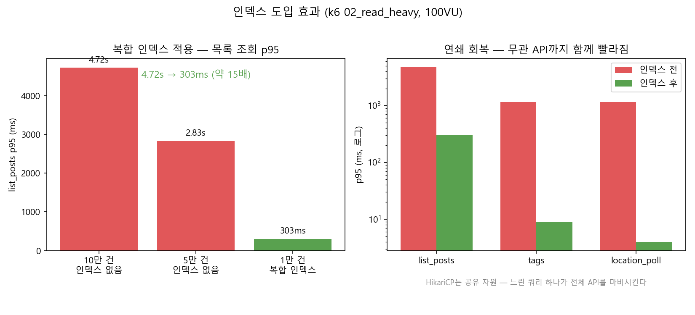
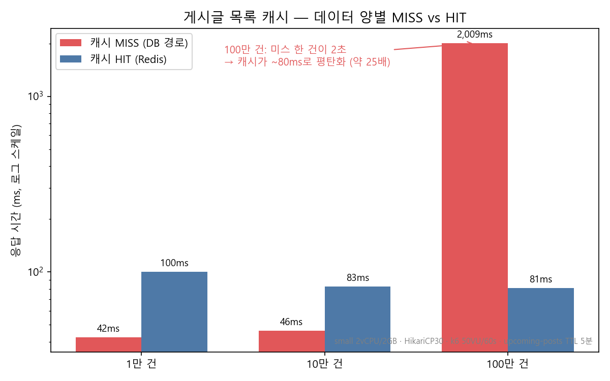
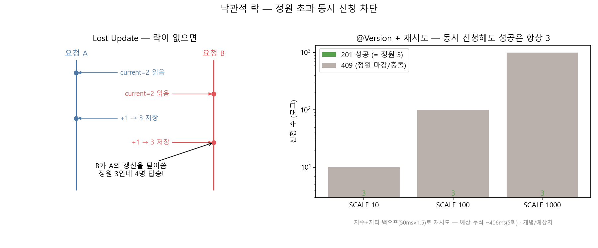
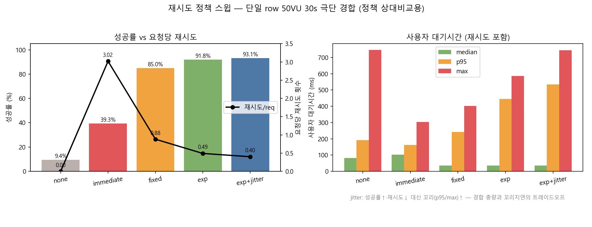

# 조회는 빠르게, 동시성은 안전하게 — 카풀 게시글 도메인을 다듬은 이야기 (인덱스 · 캐시 · 낙관적 락)

> 카풀 서비스의 핵심은 "게시글"입니다. 사람들이 끊임없이 **목록을 읽고**(조회), 마음에 드는 카풀에 **동시에 신청**합니다(쓰기). 읽기는 데이터가 쌓일수록 느려졌고, 쓰기는 정원을 초과해 태우는 동시성 버그를 안고 있었습니다.
>
> 이 글은 세 가지 도구로 이 둘을 푼 기록입니다. **복합 인덱스**로 풀스캔을 없애고, **Redis 캐시**로 반복 조회의 DB 부하를 제거하고, **낙관적 락 + 재시도**로 정원 초과 없이 동시 신청을 처리했습니다. 각각을 부하테스트로 검증했습니다.

먼저 결론부터.

- **인덱스**: 게시글이 10만 건일 때 목록 조회 p95가 **4.72s**까지 치솟았습니다. `(status, departure_time)` 복합 인덱스로 풀스캔과 정렬을 없애자 **303ms (약 15배)** 로 떨어졌습니다.
- **캐시**: 인덱스를 깔아도 페이지네이션의 `COUNT(*)`는 매칭 행 수에 비례해 계속 비쌌습니다. 100만 건에서는 캐시 미스 한 건이 **2초**까지 치솟았는데, `upcoming-posts`를 Redis에 5분 캐시하자 데이터가 100만 건이 되어도 응답이 **~80ms로 일정**하게 유지됐습니다(약 25배).
- **낙관적 락**: `maxPassengers=3`인 글에 1,000명이 동시에 신청해도 **정확히 3명만 성공**합니다. 충돌은 지수 + 지터 백오프로 재시도해 사용자에게는 거의 드러나지 않습니다.

---

## 무엇이 문제였나

게시글 도메인에는 성격이 정반대인 두 종류의 트래픽이 흐릅니다.

```
[읽기]  GET /api/v1/posts         — 목록을 끊임없이 조회 (압도적 다수)
[쓰기]  POST .../applications     — 같은 글에 여러 명이 동시에 신청 (경쟁)
```

- **읽기 쪽 문제**: 목록 조회는 `deleted=false AND status='OPEN'` 으로 거르고 `departure_time` 으로 정렬합니다. 인덱스가 없으니 게시글이 쌓일수록 매 요청이 테이블 전체를 읽고 정렬했습니다.
- **쓰기 쪽 문제**: `maxPassengers=3`인 글에 여러 명이 동시에 신청하면, 각 트랜잭션이 같은 시점의 `currentPassengers`를 읽고 각자 +1 하면서 **정원을 초과**해 태울 수 있었습니다 (lost update).

순서대로 풀어보겠습니다.

---

## 1. 인덱스 — `LIMIT 20`인데도 풀스캔이 일어났다

### 문제

목록 조회 쿼리는 이렇게 생겼습니다.

```sql
SELECT * FROM posts
WHERE deleted = false AND status = 'OPEN' AND departure_time >= now()
ORDER BY departure_time ASC
LIMIT 20;
```

`LIMIT 20`이 있으니 20건만 읽으면 될 것 같지만, 그렇지 않습니다. **PostgreSQL은 "가장 이른 출발 20건"을 알려면 어떤 행이 이른지를 먼저 알아야** 하고, 인덱스가 없으면 조건에 맞는 행을 전부 읽어 정렬한 뒤 상위 20건을 자릅니다. 즉 데이터가 늘수록 비용이 선형으로 증가합니다.

### 해결 — `(status, departure_time)` 복합 인덱스

```java
@Table(name = "posts", indexes = {
        @Index(name = "idx_posts_status_departure_time",
               columnList = "status, departure_time")
})
public class Post extends SoftDeletableEntity { ... }
```

### 왜 `status`가 앞에 오는가

복합 인덱스의 컬럼 순서에는 규칙이 있습니다 — **등치(=) 조건 컬럼을 먼저, 범위/정렬 컬럼을 뒤에.**

| 순서 | 컬럼 | 쿼리에서의 역할 | 인덱스에서 얻는 것 |
|---|---|---|---|
| 1 | `status` | `= 'OPEN'` (등치) | OPEN 행들이 인덱스 상에서 한 덩어리로 모임 |
| 2 | `departure_time` | `>= now()` (범위) + `ORDER BY` (정렬) | 그 덩어리 안에서 이미 시간순 정렬 → 범위 스캔 + 정렬 동시 해결 |

- `status`가 **선두**이므로 `= 'OPEN'`으로 인덱스를 한 번에 좁힙니다. 그 안에서 `departure_time`이 이미 오름차순으로 저장돼 있으니, `>= now()` 범위 스캔과 `ORDER BY departure_time` 정렬이 **추가 정렬 없이** 처리됩니다.
- 반대로 `departure_time`을 앞에 두면? 시간순으로는 정렬되지만 `OPEN`만 골라내는 등치 조건이 인덱스 후미로 밀려, OPEN/CLOSED/CANCELLED가 시간축에 뒤섞인 채 스캔돼 효율이 떨어집니다.

> 💡 원칙: **Equality first, Range/Sort last.** 등치로 좁히고, 그 안에서 정렬을 공짜로 얻는다.

### 결과 (k6 `02_read_heavy.js`, 100 VU, 3분, HikariCP 30)

| 환경 | list_posts p95 | 전체 p95 | 판정 |
|---|---|---|---|
| 10만 건, 인덱스 없음 | **4.72s** | 3.4s | ❌ |
| 5만 건, 인덱스 없음 | 2.83s | 1.69s | ❌ |
| 1만 건, 필터 + 복합 인덱스 | **303ms** | 157ms | ✅ |

> list_posts p95: **4.72s → 303ms (약 15배 개선)**



**연쇄 효과**가 흥미로웠습니다. 느린 list_posts가 HikariCP 커넥션 30개를 독식하던 구조였는데, 인덱스로 이게 풀리자 전혀 무관한 API들(tags 1.15s→9ms, location_poll 1.15s→4ms)까지 함께 회복됐습니다. **HikariCP는 공유 자원이라 느린 쿼리 하나가 전체 API를 마비시킬 수 있다**는 걸 확인했습니다.

> 같은 원리로 다른 도메인에도 복합 인덱스를 적용했습니다.
> - `notifications (receiver_id, read_at)` — "내 안 읽은 알림" 조회
> - `ride_locations (ride_id, recorded_at DESC)` — 운행별 최근 위치 조회

### 트레이드오프

| 항목 | 내용 |
|---|---|
| 장점 | 조회 속도 개선, 정렬 비용 제거 |
| 단점 | INSERT/UPDATE 시 인덱스 갱신 비용 추가 |
| 수용 근거 | 카풀은 읽기가 쓰기보다 압도적으로 많은 read-heavy 서비스 |

---

## 2. 캐시 — 인덱스로도 안 사라지는 비용: 페이지네이션 COUNT

### 인덱스를 깔았는데 왜 또 캐시?

인덱스가 첫 페이지 20건을 빠르게 가져오는 건 맞습니다. 하지만 페이지네이션 응답은 `totalElements`(전체 개수)를 함께 줘야 하고, 그러려면 이런 쿼리가 따라붙습니다.

```sql
SELECT COUNT(*) FROM posts
WHERE deleted = false AND status = 'OPEN'
  AND departure_time >= now() AND departure_time < now() + INTERVAL '48 hours';
```

`COUNT(*)`는 **매칭되는 행을 전부 세야** 하므로, 인덱스가 있어도 매칭 집합이 클수록 비싸집니다. 메인 목록은 모든 사용자가 거의 똑같이 보는 화면인데, 이 비용을 **매 요청마다** 치르고 있었습니다.

### 해결 — `upcoming-posts` Redis 캐시

오늘~+48시간 출발 게시글 목록을 Redis에 **5분 TTL**로 캐시했습니다.

```java
@Configuration
@EnableCaching
public class CacheConfig {
    public static final String UPCOMING_POSTS = "upcoming-posts";

    @Bean
    public RedisCacheManager cacheManager(RedisConnectionFactory factory) {
        RedisCacheConfiguration upcoming = RedisCacheConfiguration.defaultCacheConfig()
                .serializeValuesWith(... GenericJackson2JsonRedisSerializer ...)
                .disableCachingNullValues()
                .entryTtl(Duration.ofMinutes(5));
        return RedisCacheManager.builder(factory)
                .withCacheConfiguration(UPCOMING_POSTS, upcoming)
                .build();
    }
}

@Cacheable(cacheNames = CacheConfig.UPCOMING_POSTS, key = "#page + ':' + #size")
@Transactional(readOnly = true)
public PostPageCache getUpcoming(int page, int size) { ... }
```

설계하면서 부딪힌 두 가지 함정:

1. **`Page<T>`는 Redis 역직렬화가 안 된다.** `PageImpl`에 기본 생성자가 없어서 그대로 캐싱하면 깨집니다. → `PostPageCache(List<content>, totalElements)`라는 순수 DTO만 캐싱하고, 서비스에서 `PageImpl`로 재조립했습니다.
2. **자기호출(self-invocation)은 AOP 프록시를 우회한다.** `@Cacheable` 메서드를 같은 클래스에서 호출하면 캐시가 안 먹습니다. → 캐시 전담 빈 `PostUpcomingCacheService`로 분리했습니다.

쓰기(생성·수정·삭제·마감)가 일어나면 목록이 바뀌므로 `@CacheEvict(allEntries = true)`로 무효화합니다.

### 부하테스트 — 데이터 양을 키우며 캐시 ON/OFF 비교

캐시의 진짜 가치는 "데이터가 늘어도 응답이 일정한가"입니다. 그래서 **게시글을 1만 → 10만 → 100만 건**으로 늘려가며 (모두 OPEN + 48h 이내 출발로 시드해 매칭 집합 = 데이터 양) 측정했습니다.

- **COLD (MISS)**: Redis를 비우고 단발 요청 → DB 경로(=캐시 미사용) 비용
- **WARM (ON)**: `GET /api/v1/posts` 부하 → 첫 1회 MISS 후 전부 HIT
- **OFF**: `GET /api/v1/posts?date=...` (필터 경로, `@Cacheable` 미적용) 부하 → 매 요청 DB

환경: small급 컨테이너 `2 vCPU / 2GB`, HikariCP=30, k6 `08_post_cache.js` 50 VU / 60초.

가장 깨끗한 비교는 **같은 엔드포인트**에서 Redis를 비우고 친 단발 요청(MISS = DB 경로)과, 캐시가 채워진 상태의 부하(HIT)입니다.

| 데이터 양 (OPEN + 48h 매칭) | 캐시 MISS 단발 (COLD) | 캐시 HIT p95 (WARM) | HIT 처리량 | Redis hit / miss |
|---|---|---|---|---|
| 1만 건 | 42 ms | 99.96 ms | 1,015 rps | 61,157 / 0 |
| 10만 건 | 46 ms | 82.51 ms | 2,204 rps | 132,995 / 0 |
| 100만 건 | **2,009 ms** | **80.94 ms** | 2,125 rps | 128,004 / 30 |



읽는 법:

- **캐시 MISS(= DB 경로)는 데이터 양에 끌려간다.** 1만~10만 건에서는 42~46ms로 버티다가, **100만 건에서 단발 한 건이 2초**까지 치솟았습니다. 매칭 행 100만 개를 세는 `COUNT(*)`가 2GB 컨테이너의 캐시를 넘겨 디스크 I/O로 떨어진 지점입니다.
- **캐시 HIT은 데이터 양과 무관하게 일정하다.** 1만이든 100만이든 p95는 **~80–100ms**로 평평합니다. 응답이 Redis의 직렬화된 한 덩어리에서 나오므로, 뒤에 게시글이 1만 건이든 100만 건이든 상관이 없습니다.
- **100만 건 기준 단발 요청 비용을 2,009ms → 81ms (약 25배) 로 줄였고**, 그마저도 TTL 5분에 한 번만 치릅니다. 부하 중 `miss`는 0/0/30 — 사실상 100% 히트입니다(60초 동안 같은 키 재사용).

> 📌 핵심: **인덱스는 "첫 20건"을 빠르게 찾아주지만, 페이지네이션의 `COUNT(*)`는 매칭 집합 전체에 비례한다.** 데이터가 커질수록 이 비용이 살아나고, 캐시가 이걸 "요청마다"에서 "5분에 한 번"으로 바꾼다.

> 🔬 참고: 캐시 미사용 경로로 `?date` 필터(`getFilteredPosts`)도 같이 측정했지만(p95 196 / 158 / 115ms), 하루 윈도우로 매칭 집합이 좁아지고 50 VU 동시성·컨테이너 워밍에 좌우돼 데이터 양 신호가 오히려 역전됐습니다. 그래서 데이터 양 효과는 위처럼 **동일 엔드포인트의 COLD(flush) vs WARM** 축으로 봤습니다.
<!-- CACHE_RESULTS_END -->

### 왜 5분 stale이 괜찮은가 — 카풀이 글을 올리는 패턴

캐시의 단점은 stale(낡은 데이터)이다. 방금 올라온 글이 최대 5분 늦게 목록에 뜰 수 있다. 다른 도메인이라면 치명적일 수 있지만, **카풀의 사용 패턴을 보면 이 5분이 거의 무해하다.**

카풀은 실시간 호출(택시 콜)이 아니다. 사람들은 보통 **내일 아침 출근 카풀을 어제 저녁에 미리 올려둔다.** 즉 글이 올라오는 시점과 실제 출발 시점 사이에는 보통 **몇 시간~하루**의 여유가 있다. 그래서:

- 저녁 9시에 올린 "내일 8시 출발" 글이 목록에 9시 정각이 아니라 **9시 5분에 떠도** 아무 문제가 없다. 출발까지 11시간이 남았기 때문이다.
- 우리가 캐시 대상을 "오늘~**+48시간** 출발 글"로 잡은 것도 같은 이유다. 사람들이 실제로 탐색하는 구간이 "지금부터 하루 이틀 안"이라, 그 구간만 캐시하면 트래픽의 대부분을 흡수한다.

> 💡 캐시 TTL은 "도메인이 요구하는 신선도"에 맞춰야 한다. 같은 프로젝트의 **실시간 위치 공유**는 초 단위 신선도가 필요해 캐시 대신 Write-Behind를 썼고, **게시글 목록**은 분 단위 stale이 허용돼 5분 TTL이 맞았다. 한 서비스 안에서도 기능마다 답이 다르다.

게다가 글 작성·수정·삭제·마감 시에는 `@CacheEvict(allEntries=true)`로 즉시 무효화하므로, "내가 올린 글이 안 보인다" 같은 체감 문제도 대부분 방어된다(쓴 본인은 evict 직후 최신 목록을 본다).

### 트레이드오프

| 항목 | 내용 |
|---|---|
| 장점 | 반복 조회의 DB 부하 제거, 데이터 양과 무관하게 일정한 응답 |
| 단점 | 최대 5분의 stale (방금 올라온 글이 목록에 늦게 뜰 수 있음) |
| 수용 근거 | 카풀은 "전날 저녁에 다음날 글을 올리는" 패턴 — 분 단위 stale이 무해. 쓰기 시 `@CacheEvict`로 최신성 보완 |

---

## 3. 낙관적 락 — 정원 3명에 1,000명이 동시에 신청해도 안전하게

### 문제 — Lost Update

`maxPassengers=3`, `autoAccept=true`인 글에 여러 명이 동시에 신청하면:

```
시각  요청A                      요청B
t1    currentPassengers=2 읽음
t2                              currentPassengers=2 읽음
t3    +1 → 3 저장
t4                              +1 → 3 저장   ← A의 갱신을 덮어씀(정원은 3인데 4명 탑승)
```

두 트랜잭션이 같은 값을 읽고 각자 덮어쓰면서 정원이 초과됩니다.



### 해결 — `@Version` + 비관적이 아닌 **낙관적** 락

`Post`와 `Driver`에 `@Version` 컬럼을 두었습니다.

```java
public class Post extends SoftDeletableEntity {
    @Version
    private Long version;
    // ...
    public void incrementPassengers() {
        this.currentPassengers++;
        if (this.currentPassengers >= this.maxPassengers) {
            this.status = PostStatus.CLOSED;   // 정원 차면 자동 마감
        }
    }
}
```

JPA는 UPDATE 시 `WHERE id = ? AND version = ?`를 붙이고 `version`을 +1 합니다. 그 사이 다른 트랜잭션이 먼저 커밋해 version이 바뀌었으면 **갱신 행이 0건**이 되고 `ObjectOptimisticLockingFailureException`이 터집니다. → lost update가 원천 차단됩니다.

조회-후-수정 경로에서는 읽는 시점에 버전 검증을 강제하려고 `@Lock(LockModeType.OPTIMISTIC)`도 함께 걸었습니다.

```java
@Lock(LockModeType.OPTIMISTIC)
@Query("SELECT p FROM Post p WHERE p.id = :id AND p.deleted = false")
Optional<Post> findByIdAndDeletedFalseWithLock(@Param("id") Long id);
```

> **왜 비관적 락(`for update`)이 아니라 낙관적 락인가?**
> 카풀 신청 충돌은 "정원이 거의 찰 때, 막판 몇 자리"에서만 잠깐 몰립니다. 평소엔 충돌이 거의 없죠. 비관적 락은 충돌이 없을 때도 매번 행을 잠가 처리량을 깎습니다. 낙관적 락은 **충돌이 날 때만** 비용(재시도)을 치르므로 read-heavy + 가끔 경쟁인 이 워크로드에 맞습니다.

### 재시도 정책 — 지수 백오프 + 지터

낙관적 락은 "충돌하면 예외"가 끝이 아닙니다. 충돌한 요청을 **자동 재시도**해 사용자에게는 성공으로 보이게 해야 합니다. Spring Retry로 처리했습니다.

```java
@Retryable(
        retryFor = ObjectOptimisticLockingFailureException.class,
        maxAttempts = 5,                                   // 신청 생성: 경쟁 최다 → 5회
        backoff = @Backoff(delay = 50, multiplier = 1.5, random = true)  // 지수 + 지터
)
@Transactional
public ApplicationResponse apply(Long postId, Long applicantId) { ... }
```

| 적용 지점 | maxAttempts | 충돌 원인 |
|---|---|---|
| `ApplicationCreateService.apply` (신청, autoAccept 즉시 탑승) | **5** | 같은 글 `currentPassengers` 동시 증가 |
| `ApplicationStatusService.accept` (방장의 신청 승인) | 3 | 같은 글 `currentPassengers` 동시 증가 |
| `ReviewCreateService.createReview` (리뷰 → 평점 반영) | 3 | 같은 드라이버 `Driver` 평점 동시 갱신 |

**왜 지터(`random = true`)인가**가 핵심입니다. 동시에 충돌한 요청들이 *똑같은* 간격으로 재시도하면, 다음 라운드에서도 같이 부딪혀 충돌이 반복됩니다(thundering herd). 간격에 무작위성을 주면 재시도 시점이 흩어져 충돌 확률이 떨어집니다.

#### 실측 — 정책을 바꿔가며 직접 돌려봤다

말로만 끝내지 않고, 한 게시글 row에 50 VU가 30초 내내 동시 쓰기를 날려 충돌을 강제하고 정책을 바꿔가며 측정했습니다.

| 정책 | 성공률 | 요청당 재시도 | 대기 median | 대기 p95 / max |
|---|---|---|---|---|
| none (재시도 없음) | **9.4%** | 0.00 | 81ms | 191 / 748ms |
| immediate (0ms) | 39.3% | **3.02** | 102ms | 163 / 304ms |
| fixed (50ms) | 85.0% | 0.88 | 34ms | 242 / 402ms |
| exp (50ms×1.5) | 91.8% | 0.49 | 35ms | 444 / 586ms |
| **exp + jitter** ✅ | **93.1%** | **0.40** | 35ms | 534 / 744ms |



- 재시도가 없으면 경합 시 **90%가 즉시 409** — 재시도의 존재 이유.
- **즉시 재시도(immediate)가 최악**: 성공률 39%인데 요청당 3회 재시도(busy-loop)로 CPU를 잡아먹어 median도 가장 느림. 백오프 없는 재시도는 불에 기름.
- 백오프를 넣으면 median이 34ms로 뚝 — 재시도 비용은 충돌한 소수에게만.
- **지터가 성공률 최고 + 재시도 최소.** 단, **꼬리 지연(p95/max)은 가장 길다** — 전체 경합을 줄이는 대신 불운한 요청의 꼬리를 양보하는 트레이드오프. 우리는 "성공률·DB 경합 최소화"를 택해 jitter 채택.

> 🔬 한 row에 50 VU가 30초 내내 쓰는 극단 경합(실제 "막판 한 자리"보다 가혹) — 정책 **상대 비교용**. 동시성 안전 자체는 §부하테스트(정원=3)에서 검증.

#### 재시도 대기 시간 — 이론값 (per-attempt, Spring `ExponentialRandomBackOffPolicy`)

각 재시도 간격 = 직전 간격 × `U(1, 1.5)` 의 무작위 배수. 기대값 기준으로 보면:

| 재시도 회차 | 기대 대기(직전×1.25 평균) | 누적 |
|---|---|---|
| 1차 재시도 전 | ~50ms | 50ms |
| 2차 | ~75ms | 125ms |
| 3차 | ~112ms | 237ms |
| 4차 (maxAttempts=5에서 마지막) | ~169ms | **~406ms** |

> 즉 최악의 경우(5회까지 충돌)에도 사용자 체감 추가 지연은 **수백 ms 수준**이며, 지터 때문에 실제로는 이보다 분산돼 대부분 1~2회 안에 성공합니다. *(이 표는 백오프 공식 기반 예상치이며, 실측이 아닙니다.)*

재시도를 모두 소진하면 `ObjectOptimisticLockingFailureException`이 밖으로 나가고, `GlobalExceptionHandler`가 **409 Conflict**로 변환하면서 `carpool_optimistic_lock_conflicts_total` 메트릭을 올립니다.

```java
@ExceptionHandler(ObjectOptimisticLockingFailureException.class)
public ResponseEntity<ErrorResponse> handleOptimisticLockingException(...) {
    carpoolMetrics.incrementOptimisticLockConflict();
    return ResponseEntity.status(CONFLICT).body(...);  // POST_CONFLICT (409)
}
```

### 부하테스트 시나리오 (k6 `04_race_condition.js`)

`maxPassengers=3`인 글 하나에 **SCALE명이 동시에** 신청(`shared-iterations`, autoAccept로 신청 즉시 탑승 → 락 경쟁 최대화)하고, 다음을 검증합니다.

```js
export const options = {
  thresholds: {
    'successful_applications': ['count<=3'],          // 성공은 정원(3) 이하여야
    'checks{type:apply_result}': ['rate>0.99'],       // 201 or 409만 나와야
  },
};
```

| SCALE (동시 신청자) | 기대 동작 |
|---|---|
| 10 | 3명 201 성공, 7명 409. 충돌 카운터 소폭 |
| 100 | 3명 성공, 97명 409. `carpool_optimistic_lock_conflicts_total` 급증 |
| 1000 | 3명 성공, 997명 409. 재시도·지터로도 정원은 정확히 3 유지 |

핵심은 **SCALE을 아무리 키워도 `successful_applications`가 절대 3을 넘지 않는 것** — 즉 동시성 안전성이 데이터가 아니라 락으로 보장된다는 점입니다. 충돌 급증은 Grafana의 `carpool_optimistic_lock_conflicts_total`에서 관찰합니다.

### 트레이드오프

| 항목 | 내용 |
|---|---|
| 장점 | 평상시(충돌 없음) 처리량 손해 없음, lost update 원천 차단 |
| 단점 | 충돌 시 재시도 비용(수백 ms), 재시도 소진 시 409 |
| 수용 근거 | 충돌은 "정원 임박" 순간에만 몰리는 드문 이벤트 — 그 순간에만 비용을 치름 |

---

## 정리

| | 무엇을 | 어떤 문제를 | 어떻게 검증 |
|---|---|---|---|
| **인덱스** | `(status, departure_time)` 복합 인덱스 | 목록 조회 풀스캔·정렬 (p95 4.72s) | 100VU 부하, p95 4.72s→303ms |
| **캐시** | `upcoming-posts` Redis 5분 TTL | 페이지네이션 COUNT의 반복 DB 비용 | 데이터 1만~100만 단계별 ON/OFF |
| **낙관적 락** | `@Version` + 지수·지터 재시도 | 정원 초과 동시 신청 (lost update) | 정원 3에 10/100/1000 동시 신청 |

세 가지 모두 같은 철학을 따릅니다 — **흔한 경로(읽기)는 최대한 싸게, 드문 경로(충돌)는 안전하게.** 인덱스와 캐시로 읽기를 싸게 만들고, 낙관적 락으로 가끔의 경쟁만 안전하게 막았습니다.
